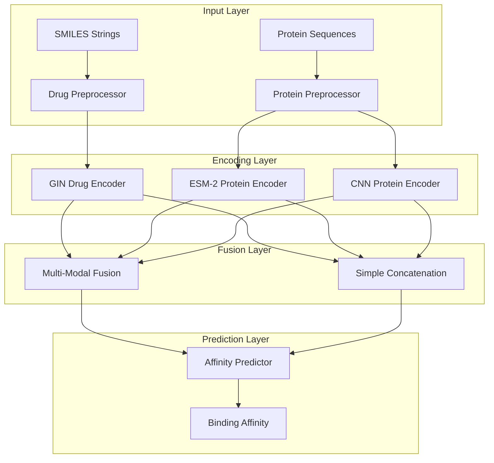

# Architecture Guide

## System Overview

The Unified DTA System is built on a modular architecture that combines state-of-the-art protein and drug encoders with flexible fusion mechanisms for accurate binding affinity prediction.

## High-Level Architecture



## Core Components

### 1. Base Components

#### BaseEncoder Abstract Class
```python
class BaseEncoder(nn.Module, ABC):
    @abstractmethod
    def forward(self, *args, **kwargs): pass
    
    @property
    @abstractmethod
    def output_dim(self) -> int: pass
```

**Purpose**: Ensures consistent interface across all encoder implementations

**Key Features**:
- Abstract base class for all encoders
- Standardized forward pass interface
- Output dimension property for downstream components

### 2. Protein Encoders

#### ESM-2 Protein Encoder
```python
class ESMProteinEncoder(BaseEncoder):
    def __init__(self, model_name='facebook/esm2_t6_8M_UR50D', 
                 output_dim=128, max_length=200):
        # ESM-2 integration with memory optimization
```

**Features**:
- Pre-trained ESM-2 language model
- Progressive unfreezing for fine-tuning
- Memory-efficient sequence processing
- Configurable output dimensions

**Input**: List of protein sequences (strings)
**Output**: Tensor [batch_size, output_dim]

#### CNN Protein Encoder
```python
class CNNProteinEncoder(BaseEncoder):
    def __init__(self, vocab_size=25, embed_dim=128, 
                 num_filters=32, filter_sizes=[3, 5, 7]):
        # Gated CNN with attention mechanisms
```

**Features**:
- Gated convolutions with residual connections
- SE attention blocks for feature enhancement
- Multiple kernel sizes for multi-scale features
- Efficient for resource-constrained environments

**Input**: Tokenized protein sequences
**Output**: Tensor [batch_size, output_dim]

### 3. Drug Encoders

#### GIN Drug Encoder
```python
class GINDrugEncoder(BaseEncoder):
    def __init__(self, input_dim=78, hidden_dim=128, 
                 num_layers=5, dropout=0.2):
        # Graph Isomorphism Network implementation
```

**Features**:
- Graph Isomorphism Networks with residual connections
- Dual pooling mechanism (mean + max)
- Batch normalization and dropout regularization
- Handles variable-sized molecular graphs

**Input**: PyTorch Geometric Data objects
**Output**: Tensor [batch_size, output_dim]

### 4. Fusion Mechanisms

#### Multi-Modal Fusion
```python
class MultiModalFusion(nn.Module):
    def __init__(self, drug_dim, protein_dim, hidden_dim=256, num_heads=8):
        # Cross-attention between drug and protein features
```

**Features**:
- Cross-attention mechanism between modalities
- Learnable projection layers for dimension alignment
- Multi-head attention for complex interactions
- Layer normalization and residual connections

#### Simple Concatenation
```python
class SimpleFusion(nn.Module):
    def forward(self, drug_features, protein_features):
        return torch.cat([drug_features, protein_features], dim=1)
```

**Use Cases**:
- Lightweight models
- Baseline comparisons
- Resource-constrained environments

### 5. Prediction Heads

#### Affinity Predictor
```python
class AffinityPredictor(nn.Module):
    def __init__(self, input_dim, hidden_dims=[512, 256], 
                 dropout=0.3, activation='relu'):
        # Configurable MLP architecture
```

**Features**:
- Flexible MLP architecture
- Multiple activation functions (ReLU, GELU, Swish)
- Dropout and batch normalization options
- Configurable layer dimensions

## Data Flow

### 1. Input Processing
```python
# Drug processing
smiles = "CCO"
mol_graph = smiles_to_graph(smiles)  # Convert to PyG Data

# Protein processing  
protein_seq = "MKTVRQERLK..."
tokens = tokenize_protein(protein_seq)  # For CNN encoder
# ESM-2 uses raw sequences directly
```

### 2. Feature Extraction
```python
# Drug encoding
drug_features = drug_encoder(mol_graph)  # [batch_size, drug_dim]

# Protein encoding
protein_features = protein_encoder(protein_seq)  # [batch_size, protein_dim]
```

### 3. Feature Fusion
```python
# Multi-modal fusion
if use_fusion:
    fused_features = fusion_layer(drug_features, protein_features)
else:
    fused_features = torch.cat([drug_features, protein_features], dim=1)
```

### 4. Prediction
```python
# Affinity prediction
affinity = predictor(fused_features)  # [batch_size, 1]
```

## Training Architecture

### 2-Phase Training Strategy

#### Phase 1: Frozen ESM-2
```python
# Freeze ESM-2 parameters
for param in esm_encoder.parameters():
    param.requires_grad = False

# Train other components
optimizer = torch.optim.Adam([
    {'params': drug_encoder.parameters()},
    {'params': fusion_layer.parameters()},
    {'params': predictor.parameters()}
], lr=1e-3)
```

#### Phase 2: Fine-tuning
```python
# Unfreeze last 4 layers of ESM-2
for layer in esm_encoder.esm.encoder.layer[-4:]:
    for param in layer.parameters():
        param.requires_grad = True

# Fine-tune with lower learning rate
optimizer = torch.optim.Adam([
    {'params': drug_encoder.parameters(), 'lr': 1e-4},
    {'params': esm_encoder.parameters(), 'lr': 1e-5},
    {'params': fusion_layer.parameters(), 'lr': 1e-4},
    {'params': predictor.parameters(), 'lr': 1e-4}
])
```

## Memory Management

### Gradient Checkpointing
```python
# Enable gradient checkpointing for large sequences
if sequence_length > 200:
    model.enable_gradient_checkpointing()
```

### Dynamic Batch Sizing
```python
# Automatic batch size adjustment
def adjust_batch_size(current_batch_size, memory_usage):
    if memory_usage > 0.9:  # 90% memory usage
        return max(1, current_batch_size // 2)
    elif memory_usage < 0.5:  # 50% memory usage
        return min(32, current_batch_size * 2)
    return current_batch_size
```

### Memory Monitoring
```python
class MemoryMonitor:
    def __init__(self):
        self.peak_memory = 0
    
    def update(self):
        if torch.cuda.is_available():
            current_memory = torch.cuda.memory_allocated() / 1024**3  # GB
            self.peak_memory = max(self.peak_memory, current_memory)
```

## Configuration System

### Model Factory Pattern
```python
class ModelFactory:
    @staticmethod
    def create_model(config_name: str) -> UnifiedDTAModel:
        if config_name == 'lightweight':
            return ModelFactory._create_lightweight_model()
        elif config_name == 'production':
            return ModelFactory._create_production_model()
        else:
            raise ValueError(f"Unknown config: {config_name}")
```

### Configuration Validation
```python
def validate_config(config: dict) -> dict:
    # Validate encoder compatibility
    if config['protein_encoder_type'] == 'esm' and config['use_fusion']:
        assert config['fusion_config']['protein_dim'] == config['protein_config']['output_dim']
    
    # Validate memory requirements
    if config['protein_encoder_type'] == 'esm':
        assert config['batch_size'] <= 8, "ESM-2 requires small batch sizes"
    
    return config
```

## Extension Points

### Custom Encoders
```python
class CustomProteinEncoder(BaseEncoder):
    def __init__(self, custom_params):
        super().__init__()
        # Custom implementation
    
    def forward(self, sequences):
        # Custom encoding logic
        return encoded_features
    
    @property
    def output_dim(self):
        return self._output_dim
```

### Custom Fusion Mechanisms
```python
class CustomFusion(nn.Module):
    def __init__(self, drug_dim, protein_dim):
        super().__init__()
        # Custom fusion implementation
    
    def forward(self, drug_features, protein_features):
        # Custom fusion logic
        return fused_features
```

## Performance Considerations

### Computational Complexity
- **ESM-2 Encoder**: O(L²) where L is sequence length
- **GIN Encoder**: O(E + V) where E is edges, V is vertices
- **Fusion Layer**: O(D × P) where D is drug dim, P is protein dim

### Memory Usage
- **Lightweight Model**: ~100MB RAM
- **Production Model**: ~4GB RAM + GPU
- **Training**: ~8GB RAM + GPU

### Optimization Strategies
1. **Sequence Truncation**: Limit protein sequences to 200 residues
2. **Gradient Checkpointing**: Trade computation for memory
3. **Mixed Precision**: Use FP16 for training acceleration
4. **Batch Size Adjustment**: Dynamic sizing based on memory usage